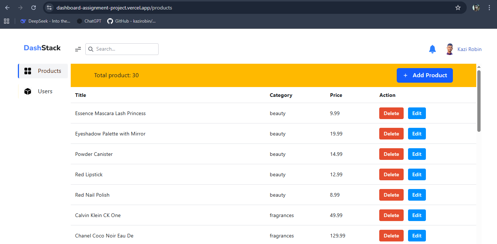

Here’s a **professional, clean, and developer-friendly `README.md`** template for your project based on the structure and details you shared.
You can copy this directly into your repository’s `README.md` file and adjust small parts (like project name, screenshots, or links) if needed.

---

# 🛍️ React Product Management Dashboard

A modern **React.js** application built with a modular architecture.
This dashboard provides dynamic components, routing, form validation, pagination, and responsive UI inspired by Figma design.
It’s designed for easy scalability and maintainability — perfect for managing products, users, and other resources.

---

## 📁 Project Structure

```
src/
├── components/
│   ├──  common/
│   │    ├── addData/
│   │    ├── dynamicButton/
│   │    ├── dynamicDialog/
│   │    ├── navbar/
│   │    ├── sidebar/
│   │    └── table/
│   └──  layouts/
│
├── data/
│   ├── products.data.jsx
│   ├── sidebar.data.jsx
├── pages/
│   │   ├── home/
│   │   ├── products/
│   │   │   ├── products.page.jsx  
│   │   ├── users/
│
├── router/
│   ├── routes.jsx
│
```

* **`routes.jsx`** → All page routing and main layout setup.
* **`components/layouts`** → Base layout (navbar, sidebar, and main content area).
* **`components/pages`** → Application pages (Home, Products, Users).
* **`components/shared`** → Reusable UI components like buttons, tables, and icons.
* **`data`** → Static data sources (e.g., products and sidebar items).

---

## 🚀 Features

✅ **Dynamic UI** – Components such as buttons, tables, and sidebar are fully reusable and dynamic.
✅ **Main Layout Structure** – Centralized layout for the entire app inside `routes.jsx`.
✅ **Routing System** – Organized React Router setup for all pages.
✅ **Responsive Design** – Fully matches Figma UI specifications.
✅ **Pagination** – Implemented for tables and product lists.
✅ **Table Column Width Fix** – Improved table responsiveness and width handling.
✅ **Formik Forms** – Used for form handling with built-in validation.
✅ **Edit/Update Product** – Functionality for product management.

---

## 🧩 Tech Stack

| Category             | Technology Used                              |
| -------------------- | -------------------------------------------- |
| **Frontend**         | React.js (Vite )                             |
| **Routing**          | React Router                                 |
| **Forms**            | Formik                                       |
| **UI Components**    | Figma Based                                  |
| **Styling**          | Radix UI                                     |

---

## 🛠️ Installation & Setup

Follow these steps to run the project locally:

### 1️⃣ Clone the Repository

```bash
git clone https://github.com/kazirobin/dashboard-assignment.git
cd dashboard-assignment
```

### 2️⃣ Install Dependencies

```bash
npm install
```

### 3️⃣ Start the Development Server

```bash
npm run dev
```

The application will be available at **[http://localhost:5173](http://localhost:5173)** (Vite default) 

---

## 🧱 Folder Overview

### `components/layouts`

Defines your **MainLayout** (Navbar + Sidebar + Outlet).
All routes share this layout for a consistent design.

### `components/shared`

Contains reusable shared UI components such as:

* `DynamicButton`
* `Navbar`
* `Sidebar`
* `Table` (with pagination and fixed column width **processing** )
* `Icon`

### `components/pages`

Contains the main views:

* **Home** – Dashboard overview
* **Products** – Product listing, editing, and pagination
* **Users** – User management page

### `data`

Holds static JSON or JS data files:

* `products.data.jsx` – Product list data
* `sidebar.data.jsx` – Sidebar items configuration

### `router/routes.jsx`

* All routes are defined here.
* MainLayout wraps around all page routes.

---

## 🧮 Form Handling

All forms are built using **Formik** with:

* Input validation
* Error handling
* Controlled form state
* Update/Edit functionality for products

---

## 🧭 Routing Example

```jsx
import { createBrowserRouter } from "react-router-dom";
import MainLayout from "../components/layouts/MainLayout";
import Home from "../components/pages/home/Home";
import Products from "../components/pages/products/Products";
import Users from "../components/pages/users/Users";

export const router = createBrowserRouter([
  {
    path: "/",
    element: <MainLayout />,
    children: [
      { path: "/", element: <Home /> },
      { path: "/products", element: <Products /> },
      { path: "/users", element: <Users /> },
    ],
  },
]);
```

---

## 📸 UI Preview





---

## 🧑‍💻 Developer Notes

* Ensure all components follow the same **naming convention** and **folder structure**.
* Use **Formik** for new forms to maintain validation consistency.
* Keep all UI updates synced with the **Figma design**.
* Reuse shared components wherever possible.


---

 Would you like me to `
 **customize this README with your repository name and project title**,
 or include 
 **badges (like React, Formik, Vite, etc.)** 
 for a more professional GitHub look?

- ui same as figma
- pagination 
- table column width problem fix 


- dynamic button 🆗
- formik for form and required validity 🆗
- update/edit product🆗
- data is up to date 🆗
- page is up to date 🆗
- typescript
- redix